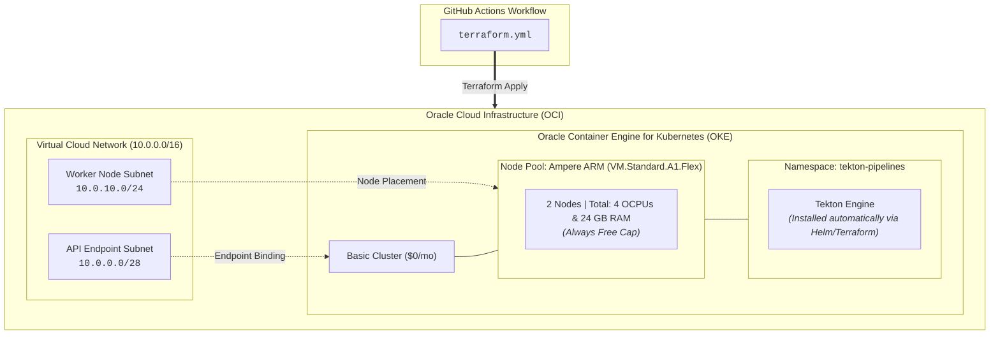

# Oracle OKE Infrastructure & Tekton Engine Provisioner

This repository contains the Infrastructure as Code (IaC) written in
**Terraform** to provision a zero-cost Kubernetes cluster on **Oracle Cloud
Infrastructure (OCI) Always Free Tier** and automatically bootstrap the **Tekton
Pipelines Engine**.

## 🏗️ Architecture



## 🛠️ Prerequisites

1. An **Oracle Cloud Infrastructure (OCI)** account.
2. An **API Key Pair** generated in your OCI User Settings.
3. A **GitHub Repository Environment** named `oci-infrastructure` with the
   following secrets:
   - `OCI_CLI_USER`: Your OCI User OCID.
   - `OCI_CLI_TENANCY`: Your OCI Tenancy OCID.
   - `OCI_CLI_FINGERPRINT`: OCI API Key fingerprint.
   - `OCI_CLI_KEY_CONTENT`: Full content of your private `.pem` key.
   - `OCI_CLI_REGION`: Your OCI active region (e.g., `eu-frankfurt-1`).
   - `OCI_COMPARTMENT_OCID`: Target compartment OCID.

## 💻 Local Execution

To test or apply the Terraform code locally:

1. **Clone the repository:**
   ```bash
   git clone [https://github.com/stanimirivanov/oci-oke-terraform.git](https://github.com/stanimirivanov/oci-oke-terraform.git)
   cd oci-oke-terraform/terraform
   ```
2. **Initialize and apply:**
   ```bash
   terraform init
   terraform plan
   terraform apply
   ```
3. Connect `kubectl` to your cluster:
   Run the command provided in `terraform output get_kubeconfig_command`.

## 🚀 CI/CD Pipeline

The included `.github/workflows/terraform.yml` handles automated infrastructure
management:

- Pull Requests: Runs `terraform plan` to preview infrastructure changes.
- Push to `main`: Runs `terraform apply` after passing owner authorization
  checks.